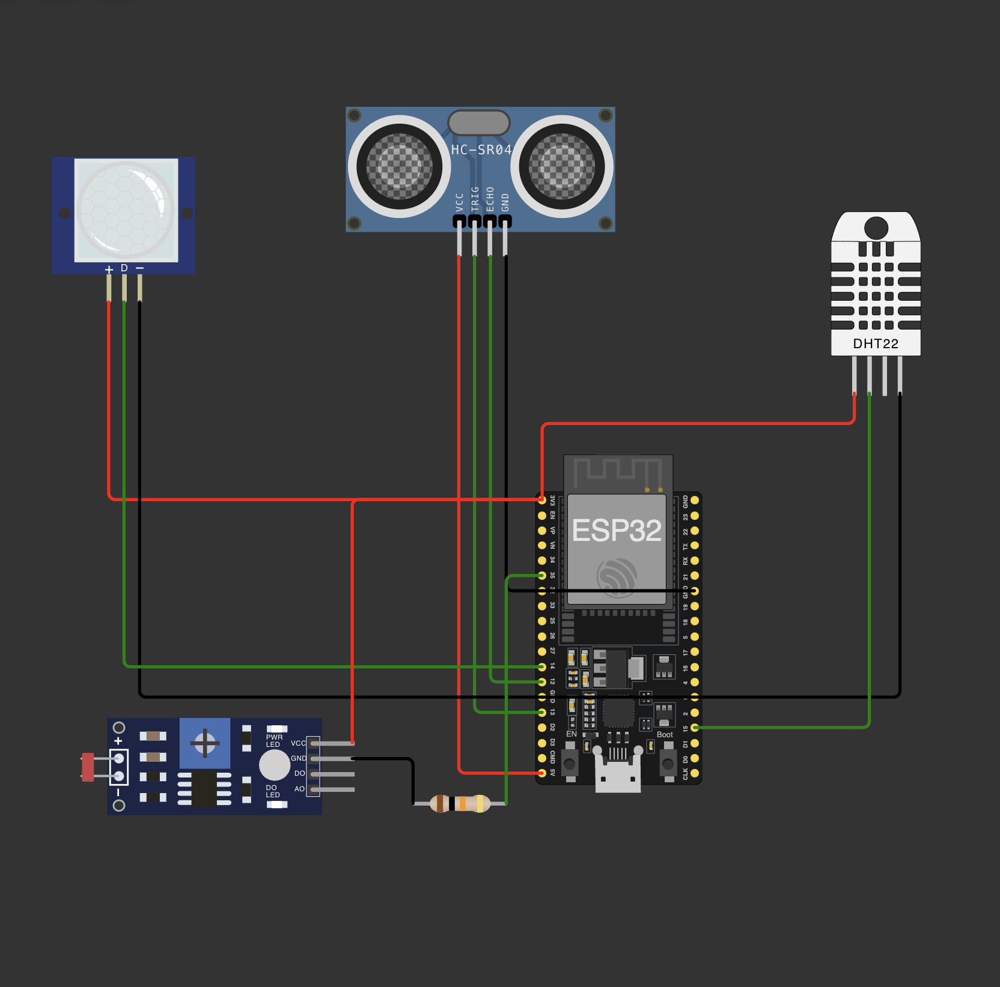
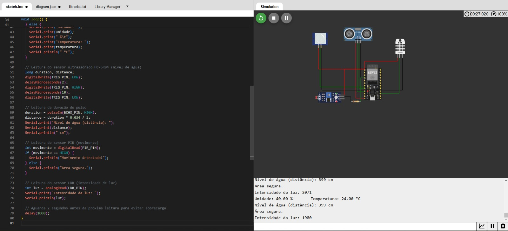

# FIAP - Faculdade de Informática e Administração Paulista

 

# Sistema Inteligente de Monitoramento Agrícola com ESP32

## Nome do grupo

## 👨‍🎓 Integrantes: 
- [WELLIGTON NASCIMENTO DE BRITO - RM 552157](https://www.linkedin.com/company/inova-fusca)
- [CELESTE LEITE DOS SANTOS - RM 559312](https://www.linkedin.com/company/inova-fusca)
- [EDUARDO CARVALHO - RM 95585](https://www.linkedin.com/company/inova-fusca)
- [LUMA SANTOS DE OLIVEIRA - RM 560146](https://www.linkedin.com/company/inova-fusca)
- [RICARDO ARAÚJO DE OLIVEIRA - RM 561182](https://www.linkedin.com/company/inova-fusca)

## 👩‍🏫 Professores:
### Tutor(a) 
- [Nome do Tutor](https://www.linkedin.com/company/inova-fusca)
### Coordenador(a)
- [Nome do Coordenador](https://www.linkedin.com/company/inova-fusca)

## 📜 Descrição

Este projeto tem como objetivo desenvolver um sistema inteligente de monitoramento agrícola utilizando o microcontrolador ESP32 e quatro sensores diferentes. O sistema coleta dados ambientais e toma decisões automatizadas para otimizar o uso de recursos na agricultura, como o controle de irrigação e a proteção das plantações contra condições adversas e invasões. Este sistema é ideal para uso em áreas agrícolas que precisam de um monitoramento contínuo e eficiente de parâmetros climáticos e de segurança.

## 📐 Desenho do Circuito

O circuito é composto por um **ESP32** e quatro sensores:
1. **DHT22** - Sensor de umidade e temperatura, utilizado para monitorar condições climáticas.
2. **HC-SR04** - Sensor ultrassônico, utilizado para medir o nível de água em reservatórios.
3. **PIR** - Sensor de movimento, utilizado para detectar a presença de animais ou pessoas.
4. **LDR** - Sensor de luminosidade, utilizado para ajustar a irrigação com base na intensidade da luz.

## 📋 Papel de Cada Sensor no Sistema

- **DHT22**: Monitora temperatura e umidade, ajustando a irrigação conforme as condições climáticas.
- **HC-SR04**: Verifica o nível de água no reservatório, ativando a irrigação quando necessário.
- **PIR**: Detecta movimento para acionar alertas de segurança, caso animais ou pessoas entrem na área.
- **LDR**: Monitora a intensidade da luz solar para ajustar a irrigação conforme a luminosidade.

## 🔧 Como Configurar e Rodar o Projeto no Wokwi e ESP32

1. **Pré-requisitos**:
   - Acesso à plataforma [Wokwi](https://wokwi.com/) para simulação do circuito.
   - Biblioteca DHT para comunicação com o sensor de umidade e temperatura.
   - Conexão do ESP32 com IDE Arduino (se for rodar o projeto em um ESP32 real).

2. **Passos para Configuração no Wokwi**:
   - Abra o Wokwi e crie um novo projeto.
   - Adicione o ESP32 e os sensores DHT22, HC-SR04, PIR e LDR conforme o desenho do circuito.
   - Conecte cada sensor ao ESP32 conforme as instruções de conexão fornecidas.

3. **Rodando a Simulação**:
   - Carregue o código fornecido na seção de código e inicie a simulação no Wokwi.
   - Abra o Monitor Serial para observar as leituras de cada sensor em tempo real.

4. **Rodando no ESP32 Real**:
   - Carregue o código no ESP32 através do Arduino IDE.
   - Abra o Monitor Serial para verificar as leituras e o funcionamento do sistema.

## 📦 Instruções de Instalação e Dependências

1. **Arduino IDE**: Utilize o Arduino IDE para programar o ESP32 se estiver usando o dispositivo real.
2. **Bibliotecas Necessárias**:
   - `DHT.h`: Biblioteca para o sensor de temperatura e umidade DHT22.
3. **Passo a Passo de Instalação**:
   - Instale a biblioteca DHT através do gerenciador de bibliotecas do Arduino IDE.
   - Configure o ESP32 no Arduino IDE (caso não esteja configurado).
   - Copie o código do projeto para o Arduino IDE e faça o upload para o ESP32.

## 🧪 Testes Realizados

Para validar o funcionamento do sistema, realizamos testes de cada sensor individualmente e em conjunto. Abaixo estão alguns prints do Monitor Serial mostrando as leituras:

1. **Leitura do DHT22**:
   - Exibe a umidade e a temperatura atual.

2. **Leitura do HC-SR04**:
   - Exibe a distância medida, representando o nível de água.

3. **Leitura do PIR**:
   - Indica "Movimento detectado!" quando algo passa na frente do sensor.

4. **Leitura do LDR**:
   - Exibe a intensidade da luz, variando de acordo com a luminosidade do ambiente.

## 📁 Estrutura de Pastas

- **.github**: Arquivos de configuração específicos do GitHub.
- **assets**: Arquivos de imagem e outros elementos visuais.
- **config**: Arquivos de configuração do projeto.
- **document**: Documentos do projeto.
- **scripts**: Scripts auxiliares para tarefas específicas.
- **src**: Código fonte do projeto.
- **README.md**: Este arquivo, contendo a documentação completa do projeto.

## 🔄 Histórico de Lançamentos

* 0.5.0 - XX/XX/2024 - Versão final com todos os sensores implementados.
* 0.4.0 - XX/XX/2024 - Adicionado o sensor de luminosidade (LDR).
* 0.3.0 - XX/XX/2024 - Adicionado o sensor de movimento (PIR).
* 0.2.0 - XX/XX/2024 - Adicionado o sensor ultrassônico (HC-SR04).
* 0.1.0 - XX/XX/2024 - Versão inicial com o sensor DHT22.

## 📜 Licença

<a property="dct:title" rel="cc:attributionURL" href="https://github.com/agodoi/template">MODELO GIT FIAP</a> por <a rel="cc:attributionURL dct:creator" property="cc:attributionName" href="https://fiap.com.br">Fiap</a> está licenciado sobre <a href="http://creativecommons.org/licenses/by/4.0/?ref=chooser-v1" target="_blank" rel="license noopener noreferrer" style="display:inline-block;">Attribution 4.0 International</a>.

